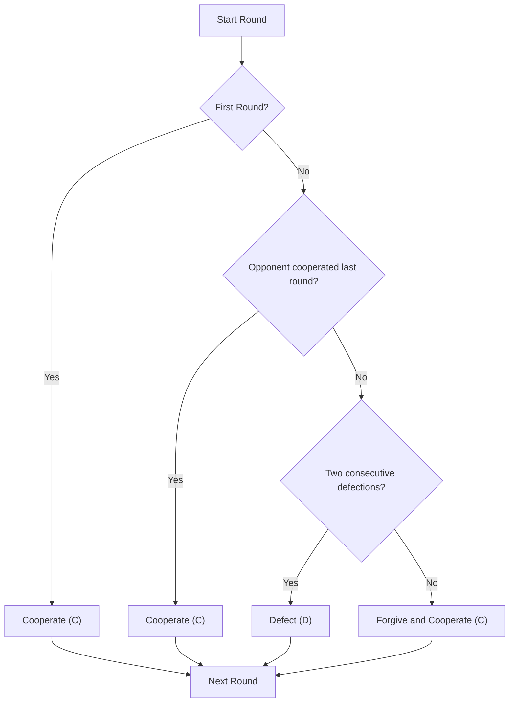

# Alvaro Agent(Tit-for-Two)

**Strategy:** Cooperate on round 1, forgive one isolated defection, and defect only after two consecutive defections.

## Description

The Alvaro Agent implements a forgiving variation of Tit-for-Tat for the Iterated Prisoner's Dilemma. Instead of retaliating immediately after a defection, this agent gives the opponent one chance to return to cooperation. It only retaliates when the opponent defects two rounds in a row.

**Philosophy:**
- **Round 1:** Be nice—start with cooperation
- **Opponent cooperates:** Cooperate
- **One isolated defection** Forgive and cooperate
- **Two consecutive defections:** Retaliate with defection
- **Opponent returns to cooperation:** Cooperate again

**Effect** Encourages cooperation while avoiding unnecessary retaliation against isolated defections.

## Decision Tree



## Behavior Examples

### vs. Another Copycat
```
Round 1: Me=C, They=C  (mutual cooperation)
Round 2: Me=C, They=C  (stay cooperative)
Round 3: Me=C, They=C  (and so on...)
Average: 3 points/round (perfect mutual cooperation)
```

### vs. Random Agent
```
Round 1: Me=C, They=? (random)
Round 2: Me=C, They=? (random)
...varies based on random opponent
Behavior varies depending on the random opponent
```

### vs. Always-Defect
```
Round 1: Me=C, They=D  (I cooperate, they defect → I get 0)
Round 2: Me=C, They=D  (first consecutive defection is forgiven)
Round 3: Me=D, They=D  (second consecutive defection → retaliation)
Round 4: Me=D, They=D  (two consecutive defections again → retaliation)
```

## Key Characteristics

- **Nice:** Starts with cooperation
- **Forgiving:** Forgives a single isolated defection
- **Retaliatory:** Defects after two consecutive defections
- **Cooperative:** Returns to cooperation when the opponent cooperates
- **Simple:** Uses the opponent's previous two moves to make decisions

## Why This Works

1. **Mutual cooperation** Both agents can receive 3 points per round.
2. **Forgiveness** an isolated defection does not immediately create a retaliation cycle.
3. **Retaliation** Two consecutive defections are punished.
4. **Cooperation** The agent returns to cooperation when the opponent cooperates.

## How to Modify (For Students)

This is a great starting point for experiments:

```python
# Variant: Tit-for-Two-Tats (retaliate only after 2 defections)
# Variant: Generous Tit-for-Tat (forgive 10% of defections)
# Variant: Tit-for-Tat with Noise (add random forgiveness)
```

## Usage

```bash
# Play against random agent:
python utils/match_runner/run_match.py alvaro_agent random_agent --rounds 100

# Include in tournament:
python utils/tournament_runner/run_tournament.py
# (copycat_agent will be discovered automatically)
```

## Historical Context

Tit-for-Tat was submitted by Anatol Rapoport to Robert Axelrod's famous 1984 tournament. It won with just 4 lines of code, proving that simple strategies can outperform complex ones in game theory.

---

**Expected Performance:** 
- vs. Copycat: ~3 points/round when both agents cooperate
- vs. Random: Performance varies depending on random choices
- vs. Second chance: high cooperation when both agents cooperate
