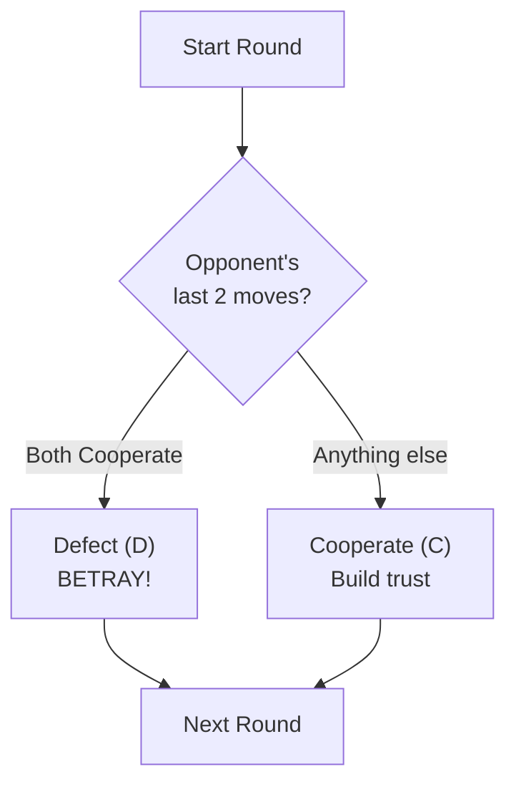

# Do Be Evil Agent

**Strategy:** Cooperate initially to build trust, then defect when opponent shows two consecutive cooperations.

## Description

The "Do Be Evil" agent implements a **deceptive betrayal strategy**. It starts by cooperating to appear trustworthy, but the moment it detects two consecutive cooperations from the opponent, it defects to exploit their trust.

This is a predatory strategy that preys on naive or cooperative opponents who assume mutual cooperation.

**Philosophy:**
- Round 1+: Cooperate to build false trust
- When opponent cooperates twice in a row: **Betray them**
- Extract maximum value by exploiting cooperation

## Decision Tree

## Behavior

| Situation | Action |
|---|---|
| Round 1 | Cooperate (C) - build trust |
| vs. Random opponent | Likely cooperate (waiting for 2 in a row) |
| vs. Always-Cooperate | Defect on round 3+ (when 2 cooperations detected) |
| vs. Defector | Cooperate (never gets 2 cooperations to trigger betrayal) |
| vs. Tit-for-Tat | Cooperate → cooperate → cooperate... (mutual cooperation, never betrays) |

## Key Characteristics

- **Deceptive:** Appears cooperative initially
- **Predatory:** Exploits cooperative opponents
- **Conditional Traitor:** Only defects under specific condition
- **High Risk/High Reward:** Works great against naive cooperators, fails against defensive strategies

## Expected Performance

- **vs. Always-Cooperate:** ~4.5 points/round (cooperate for 2 rounds @ 3pts, then defect @ 5pts average)
- **vs. Random Agent:** ~2.5 points/round (cooperative pattern is rare)
- **vs. Always-Defect:** ~1 point/round (never gets chance to betray)
- **vs. Tit-for-Tat:** ~3 points/round (triggers tit-for-tat retaliation after betrayal)
- **vs. Another Do-Be-Evil:** ~2.67 points/round (both cooperate then both defect)

## Why This Strategy?

This demonstrates the fundamental dilemma in game theory: 
- **Pure cooperation** gets exploited by defectors
- **Early defection** loses potential cooperation benefits
- **Conditional betrayal** tries to have it both ways—gain from cooperation, then exploit

This strategy is vulnerable to defensive tactics like Tit-for-Tat that immediately retaliate against betrayal.

## Vulnerabilities

- **Tit-for-Tat counters it:** After defection, gets retaliation every round
- **Second Chance Agent:** Will forgive once but retaliate on pattern
- **Defensive strategies:** Any strategy that punishes defection after cooperation

## See Also

- `copycat_agent/` — Tit-for-tat (defensive)
- `second_chance_agent/` — Forgiving but retaliatory
- `random_agent/` — Unpredictable
- `docs/game_rules.md` — Game mechanics and payoff matrix
