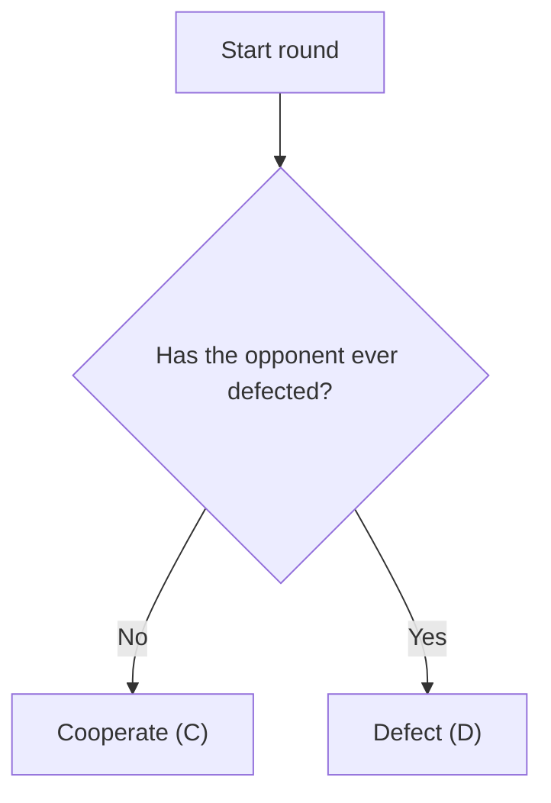

# Alejandro Agent (Grim Trigger)

**Strategy:** Cooperate until the opponent defects once, then defect permanently.

## Description

The Alejandro Agent implements a deterministic Grim Trigger strategy. It cooperates on the first
round and continues cooperating while the opponent has never defected. After the first observed
defection, it defects for the rest of the match.

The implementation derives its state directly from `opponent_history`. It does not inspect the
opponent's identity, files, runtime state, random generator, or tournament ordering. It also does
not depend on whether the number of rounds is known.

## Decision Tree



## Why This Strategy

The tournament rewards total accumulated points. Persistent cooperation earns three points per
round against cooperative strategies and during self-play. A first defection shows that continued
unconditional cooperation is unsafe, so the agent switches to permanent defection and cannot be
repeatedly exploited.

The policy is intentionally simple, deterministic, and valid for both known and unknown horizons.

## Expected Behavior

| Opponent behavior | Alejandro Agent response |
|---|---|
| Never defects | Cooperates throughout the match |
| Defects once | Cooperates in that round, then defects permanently |
| Always defects | Loses the first-round temptation payoff, then reaches mutual defection |
| Identical Alejandro Agent | Maintains mutual cooperation |

## Limitations

This is not a universally winning strategy. It ties with an identical copy and loses five points
overall against Always Defect because its first cooperation occurs before the opponent's move can
be observed. An isolated mistake can also cause permanent mutual defection.

## Usage

Run a match from the project root:

```bash
python utils/match_runner/run_match.py estrategia_alejandro random_agent --rounds 50
```

Include the agent in the full tournament:

```bash
python utils/tournament_runner/run_tournament.py --rounds 100
```
