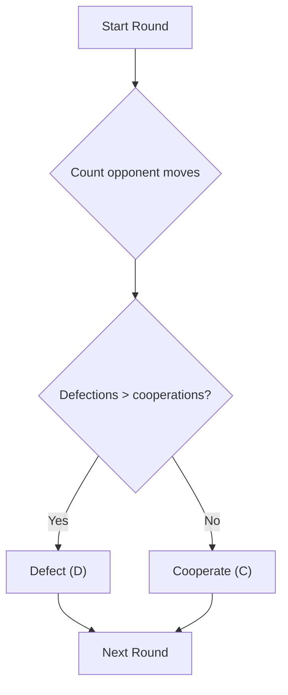

# Alejandro Agent (Majority Response)

**Strategy:** Play the move that the opponent has used most often in the match.

## Description

The Alejandro Agent is a history-based strategy. It counts the opponent's
cooperative and defective moves, then responds with the move that appears 
most frequently. When both moves have the same count, it cooperates.

This makes the opening move cooperative because the history is empty and 
both counts are zero. After that, the agent adapts to the opponent's 
dominant behavior instead of copying only the previous round.

## Decision Tree

## Why This Strategy

This strategy balances cooperation and self-protection by following the
opponent's most common move. It cooperates when there is no clear majority and
adapts to persistent defection, while remaining simple, deterministic, and
less reactive to isolated mistakes.

