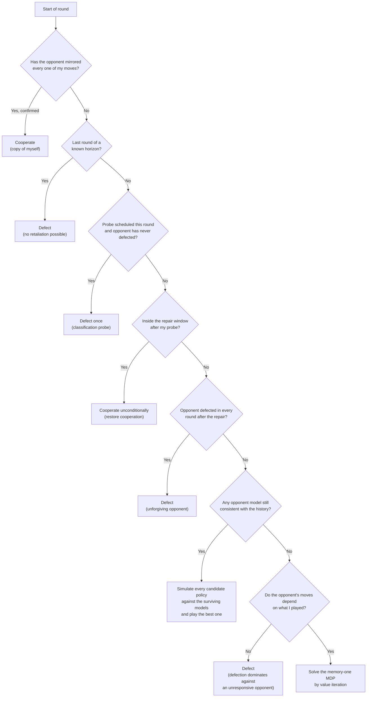

# Estrategia Daniel — Adaptive Best Response

## Description

An adaptive agent that identifies the opponent while the match is being played and answers with
the best response to whatever it has identified. It is nice by default, it never defects first
against a mirror image of itself, it spends exactly one defection to classify opponents that are
otherwise indistinguishable, and it protects itself against opponents that never forgive.

The design starts from three properties of the scoring rules rather than from a fixed heuristic:

1. **The tournament ranks by total accumulated points**, not by head-to-head wins. Losing a match
   by a small margin while scoring well is better than winning it while scoring badly.
2. **Self-play contributes two rows to the same agent.** The pairing of an agent against itself is
   worth `6 × rounds` points under mutual cooperation, more than the maximum extractable from any
   other single opponent. Defecting against a copy of oneself, including on the last round, is the
   most expensive mistake available in this tournament.
3. **Defecting on the final round is weakly dominant** against any opponent that is not a copy of
   this agent: it pays 5 instead of 3 against a cooperator, 1 instead of 0 against a defector, and
   no future round remains in which the opponent could retaliate.

## Decision Tree



## How It Works

### 1. Mirror detection

A deterministic strategy playing against a copy of itself produces **identical histories on both
sides** in every round. That invariant identifies a twin without spending a single point, and once
confirmed the agent cooperates unconditionally and disables its endgame defection.

The status is **revocable**: it is re-checked every round, so an opponent that imitates the pattern
in order to harvest free cooperation loses the privilege the first time it defects. The maximum cost
of being fooled is one round at zero points.

### 2. Online identification by consistency filtering

The agent carries a library of deterministic opponent models — unconditional cooperation and
defection, tit-for-tat and its suspicious, hard, endgame and two-tats variants, grim trigger,
win-stay lose-shift, alternators, majority followers, defection-density thresholds, second-chance
counters, trust breakers, probers. Every round each model is replayed against the observed history
and any model that fails to reproduce the opponent's actual moves is discarded permanently.

This costs nothing: the information is already in `opponent_history`.

### 3. Best-response planning

Against the surviving models the agent simulates a library of candidate policies — always cooperate,
always defect, tit-for-tat, cooperate-once-then-defect, and periodic patterns of the form `D^a C^b` —
over the remaining horizon, and plays the one with the highest average payoff. Averaging over the
surviving set is an implicit hedge: while the opponent's identity is still ambiguous, the agent plays
what works across every remaining possibility.

The periodic patterns are what make the difference against opponents that reason about **defection
density** or about **which move the opponent has played most often**: against a majority follower,
alternating cooperation and defection keeps the defection count at or below the cooperation count, so
the opponent keeps cooperating while this agent collects 4 points per round instead of 3. Against a
threshold of three defections in the last five rounds, a `DDCCC` cycle stays permanently under the
threshold.

### 4. The classification probe and the repair protocol

Opponents that cooperate unconditionally, opponents that follow the majority, opponents with a
defection threshold and opponents that never forgive are **all indistinguishable while this agent
cooperates**: every one of them just plays `C`. Only a defection separates them, so the information
has a price.

The agent pays it once, and only against an opponent that has cooperated in every round so far — an
opponent that has already defected is informative for free. Immediately afterwards it enters a
**repair window** of unconditional cooperation, which serves three purposes at once: it restores
mutual cooperation with retaliatory strategies, it separates a recoverable punisher from an
unforgiving one, and it avoids the retaliation spirals that destroy a match against tit-for-tat
variants.

If the opponent defects in every round following the repair window, it is classified as unforgiving
and the agent switches to permanent defection, which is the best response to a permanent defector.

### 5. Adaptive probing schedule

Whether probing pays depends on the composition of the field: it gains roughly one point per
remaining round against a tolerant opponent and loses two against an unforgiving one. Since instances
are recreated for every pairing but the class object is loaded once per tournament, the agent
measures the realised payoff of each probe and keeps a running estimate at class level.

The schedule starts **optimistic** — probing early, where the information is worth the most — and is
downgraded only if the measured evidence turns negative: first to a late, cheap probe, and then to no
probe at all. Against a field full of unforgiving strategies the agent therefore stops paying for
information it cannot use.

### 6. Generic core for unknown opponents

When no model survives, the agent estimates the opponent's conditional cooperation probabilities
given its own last move, with Laplace smoothing. If those probabilities are statistically
indistinguishable, the opponent does not react to this agent's behaviour, and defection dominates in
every round — this is the correct answer against random or blind strategies, and it is worth 3 points
per round instead of the 2.25 that tit-for-tat obtains against a coin flip. Otherwise the resulting
two-state Markov decision process is solved by value iteration and the optimal action is played.

## Expected Behaviour

| Opponent behaviour | Response |
|---|---|
| Copy of this agent | Full mutual cooperation, no endgame defection |
| Tit-for-tat and forgiving variants | Cooperation, one classification probe, immediate repair |
| Unforgiving (grim trigger) | Cooperation until the probe, permanent defection afterwards |
| Majority follower | Alternating cooperation and defection, kept under the majority threshold |
| Defection-density threshold | Periodic pattern kept permanently under the threshold |
| Cooperates until it sees two cooperations | Permanent defection |
| Cooperates forever after one cooperation | One cooperation, then permanent defection |
| Random or blind to this agent's moves | Permanent defection |
| Permanent defector | Permanent defection |

## Safety and Cost

- `play()` never raises: any internal failure degrades to cooperation, so a defect in this agent can
  never abort the tournament for the rest of the participants.
- Every return value is `"C"` or `"D"`, validated by 400 randomised matches with horizons in
  `{None, 1, 2, 3, 50, 100, 200}` and lengths between 1 and 150 rounds.
- Only the standard library and `utils.game_core` are imported. No file access, no network, no
  subprocesses, no inspection of the opponent's identity, runtime state or random generator, and no
  modification of any component under `utils/`.
- Payoffs are read from `config.json` through `utils.game_core.payoff.get_config()` instead of being
  hard-coded, so the agent stays correct if the payoff matrix is edited.
- The whole 20-agent round-robin over 100 rounds runs in about 0.3 s.

## Limitations

This is not a universally winning strategy, and no strategy is. Two limitations are known and
deliberate:

- **In a field made exclusively of nice, non-exploitable strategies**, any deviation from
  unconditional cooperation can only cost points. In a simulated seven-agent field of that kind the
  agent finishes mid-table by roughly 100 points. The adaptive schedule reduces but does not remove
  this cost, because the first probes are what produce the evidence.
- **Against an unforgiving opponent the probe is irreversible.** Once a grim trigger has been
  provoked the best available outcome is mutual defection. The adaptive schedule exists precisely to
  stop paying that price when the field turns out to be full of them.

## Usage

```bash
python utils/match_runner/run_match.py estrategia_daniel copycat_agent --rounds 100
python utils/tournament_runner/run_tournament.py --rounds 100 --verbose
```
