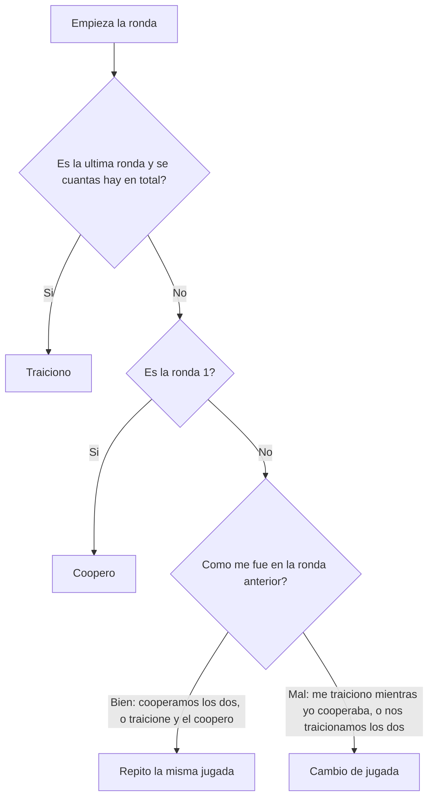

## Descripción

Empiezo cooperando siempre. Después de cada ronda, miro si el resultado
me fue bien o mal. Si cooperamos los dos (3 puntos), o si yo traicioné y el rival
cooperó (5 y 0 puntos), me fue bien y repito la misma jugada. Si el rival me traicionó
mientras yo cooperaba (0 y 5 puntos), o si nos traicionamos los dos (1 punto), me fue mal y cambio
de jugada. En la última ronda (si se sabe cuántas rondas hay en total),
traiciono siempre, porque ya no hay forma de que me castiguen por ello.

## Diagrama de decisión

