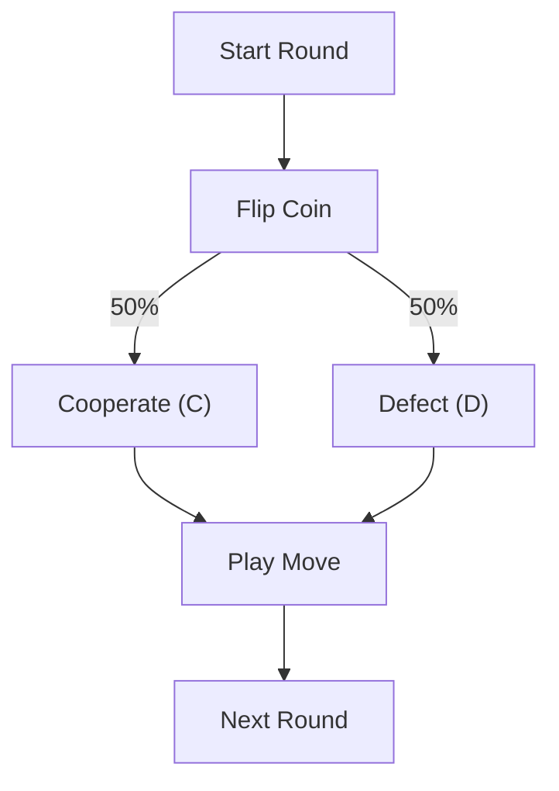

# Random Agent

**Strategy:** Play a random move each round (50% cooperate, 50% defect).

## Description

The Random Agent serves as a baseline "fictitious opponent" for testing student strategies. It makes no decisions based on history or opponent behavior—it simply flips a metaphorical coin to decide whether to cooperate or defect.

**Purpose:** This agent is useful for:
- Testing new strategies against an unpredictable opponent
- Baseline performance comparison
- Simple verification that your agent can play the game

## Decision Tree



## Behavior

| Situation | Action |
|---|---|
| Any round | Random choice: 50% C, 50% D |
| vs. Cooperator | Defects ~50% of the time |
| vs. Defector | Cooperates ~50% of the time |
| After many rounds | No pattern emerges (memoryless) |

## Key Characteristics

- **Memoryless:** Ignores all history (own and opponent's)
- **Unpredictable:** No pattern to exploit
- **Fair opponent:** ~50/50 cooperation rate
- **Good baseline:** Easy to beat with even simple strategies

## Usage

```bash
# Test your agent against random:
python utils/match_runner/run_match.py my_agent random_agent --rounds 50

# Include in tournament:
python utils/tournament_runner/run_tournament.py
# (random_agent will be discovered automatically)
```

## Code

See `agent.py` for the implementation. It's intentionally simple:

```python
class RandomAgent(Agent):
    def play(self, own_history, opponent_history):
        return random.choice([COOPERATE, DEFECT])
```

---

**Expected Performance:** Random Agent vs. Random Agent ≈ 2 points/round average (50% C @ 3pts, 50% D @ 1pt).
