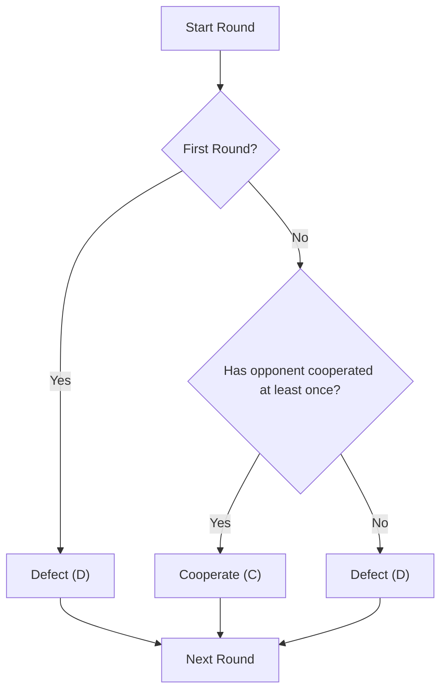

# Earn My Trust Strategy

## Description
**Strategy:** Defect in the first round. In subsequent rounds, cooperate if the opponent has cooperated at least once; otherwise, defect.
## Decision Tree

## Why This Strategy?
The strategy starts by defecting, which allows the agent to protect itself from an opponent that may always defect. If the opponent cooperates at least once, the agent responds by cooperating from that point onwards. If the opponent never cooperates, the agent continues to defect.


## Usage

```bash
# Play against random agent:
python utils/match_runner/run_match.py copycat_agent random_agent --rounds 100

# Include in tournament:
python utils/tournament_runner/run_tournament.py
# (copycat_agent will be discovered automatically)
```
---

**Expected Performance:** 
- vs. Copycat: ~3 points/round (mutual cooperation)
- vs. Random: ~2 points/round (average)
- vs. Defector: ~1 point/round (stuck in retaliation)
